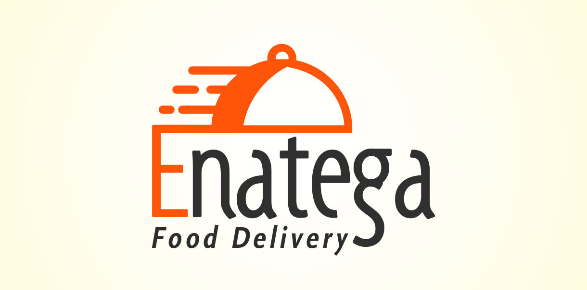
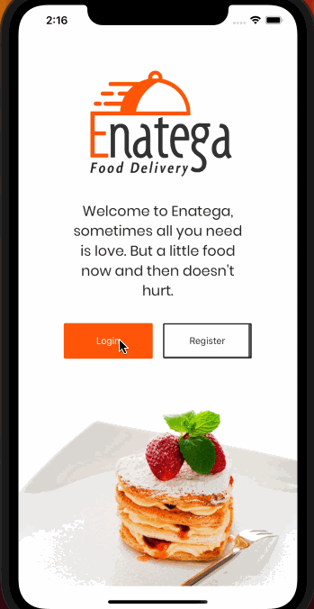

# Food Delivery UI Theme

Enatega is a comprehensive starter kit food ordering UI theme built in React Native using Expo for iOS and Android platforms. With a focus on aesthetics and best coding practices, Enatega provides a fully customizable solution for your next food delivery project.

Designed with the real-world application in mind, Enatega's flow and components are carefully crafted to minimize the need for extensive modifications. It includes essential components such as review cards, rating system, and food tracking system, making it easy to implement common features of food delivery applications.

Enatega's UI is developed from scratch, without relying on any frameworks or libraries, allowing for easy customization of components and reducing the overall code footprint. With its visually appealing design and optimized codebase, Enatega is the perfect choice for creating a professional and polished food ordering app that stands out in the market.

  

## Technologies Used

Enatega is made using some core libraries for handling navigation React Navigation is used for making layouts only flex is used. It is built using Expo.

- React Native
- React Navigation
- Expo

## Installation

Enatega is easy to install and use. It's focus is on good design so you don't have to make major changes in design as well as easy. The tools used in making Enatega is to make development experience much simpler.
Food Ordering App Theme Enatega will come with expo project.

**System Requirements**

- Globally installed node >= 6
- Globally installed npm >= 3
- Globally installed react-native CLI
- Globally installed Expo

**Installation**

- **Get the code**

  - Opt #1. Download ZIP

    If you don't know how to use Git you can download Enatega - Food Delivery UI Theme by Clicking here. Extract the content of the zip files, please note that downloading will not sync with further updates of Food Ordering App

  - Opt#2. Clone

    To setup Enatega - Food Delivery UI Theme on your system, and sync with constant updates, clone the repo. Click here to clone Enatega - Food Delivery UI using GitStrap.

- **Install packages**
  - cd food-delivery-ui
  - npm install
  - or instead of npm install you can use yarn install
- **Run on iOS**
  - Run expo start in your terminal
  - An expo interface will open select the option run on iOS simulator
  - To run on iOS device enter the url of expo given in opened interface in your expo app on iOS by downloading expo from AppStore
- **Run on Android**
  - Run expo start in your terminal
  - Make sure you have an Android emulator installed and running
  - Click the option run on android emulator in the opened interface in your expo app
  - To run on device scan the QR code given in opened expo app web interface

## Documentation

Find the link for the complete documentation of the OLO UI app [here](https://sharan-gohar.gitbook.io/workspace/).

## Get the Latest News

## Reporting an issue

[Github Issues](https://github.com/Ninjas-Code-official/food-delivery-ui/issues) are used to track todos, bugs, feature requests, and more.
Also check our [discord community](https://discord.gg/ef6PT6ZH). We'd like to help.

## Contributing

Are you a dev and would like to help? Found a bug that you would like to work on? Great! We have written down a [doc guide](https://sharan-gohar.gitbook.io/workspace/) so you can start easily
